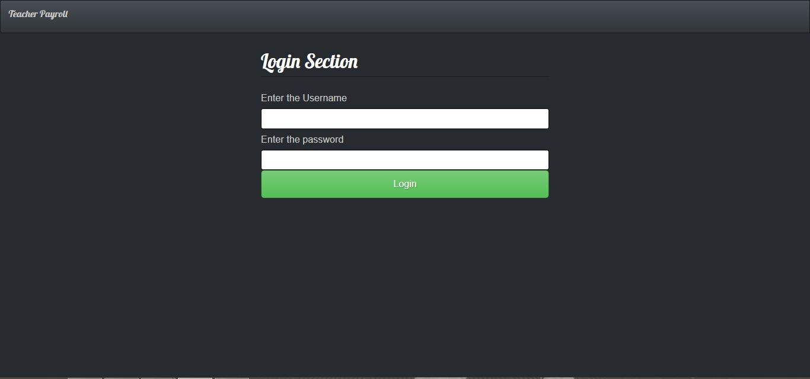
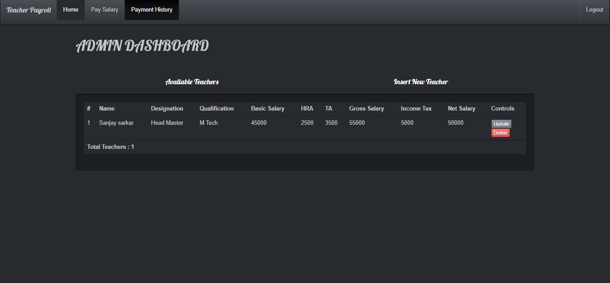
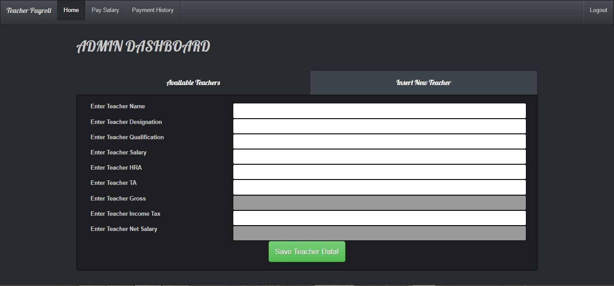
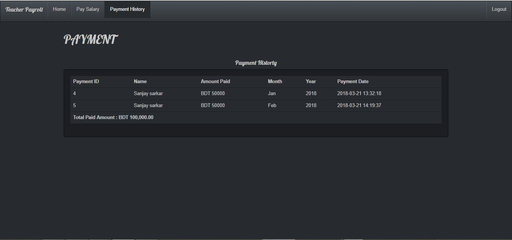

# Teacher Payroll Management System

*Small PHP & Mysql Application to Manage Teacher's Payroll Information using PHP web service API Mechnism*

## Introduction

This is a web application built using PHP. It can keep track of the payroll of the teachers in an Institute. The administration can pay the teachers and keep the record of the payment.

See the list of available teachers.
 Easily can view the teachers information.
 Pay the teacher and keep history of payment easily.
 Login Information

 Username: admin
 Password: pass
 

## Layouts
### Login
 
### Home
 
### Add New Teacher
 
### Update Teacher Information
 
### Making Payment
 
### Payment History
 
### Features

Adding new teacher if a new teacher joins the institute

Updating Teacher Information and Salary detail if needed

Delete a teacher if they leave the institute

Making payment to the teacher

Saving the payment information in the payment history
